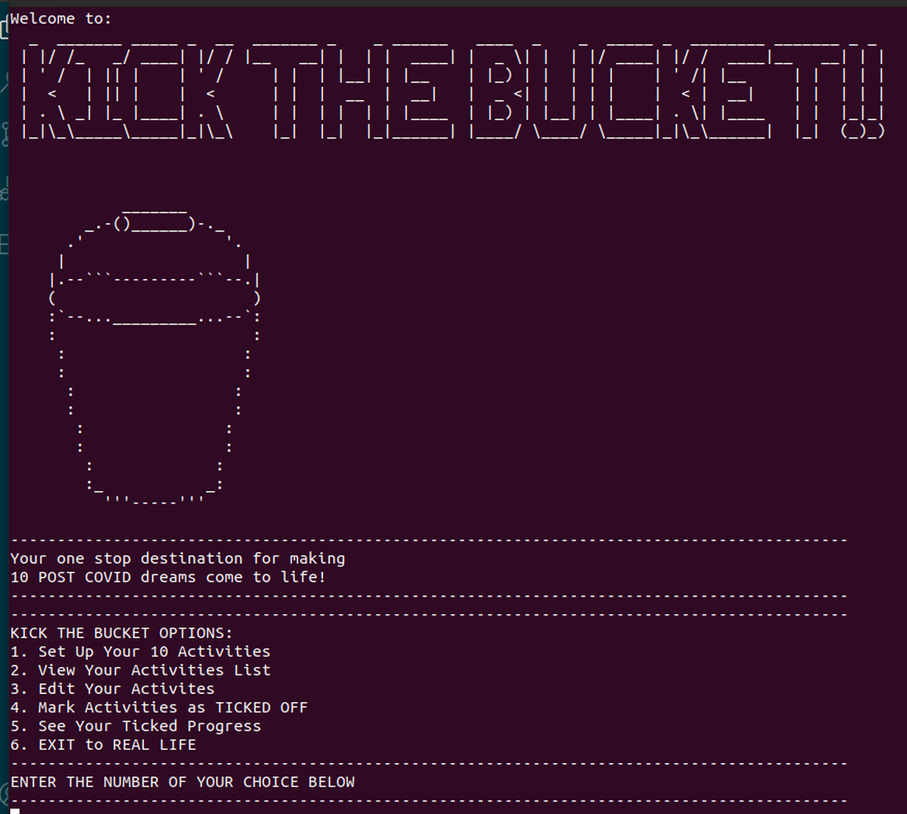

# kicktheBUCKET
## Ruby Terminal App by Suz Topp

### Your POST COVID Bucket List Extravaganza App

---

---

### Link to GitHub Respository

https://github.com/suztopp/kicktheBUCKET

---

### Statement of Purpose

Kick The Bucket has been developed for all the people who need a goal list to achievel.  Especially the current pandemic, and the hold it's placed on travel and living life, this app will help the user create a DREAM BUCKET LIST, and show them how much progress they've made as a motivational tool.

The application is targetted towards adults, but would appeal to many age groups. 
Most people have a bucket list, and again most of those people with lists would like a way to monitor and tick off this list while they have time.

In my online life I noticed a lack of programs like this one. After being in multiple lock downs and unable to visit my family in both New Zealand and Ireland for some time, and after a brainstorm at home, I realised this would be a great one for me to attack. 

The user will be able to set up their initial list of 10 Bucket List Goals and then edit the existing activities, or mark them as TICKED when completed.  

---

#### Install

1. CD into kicktheBUCKET
2. run 'bundle install'

#### Dependencies

- Ruby
- Terminal
- rspec gem
- artii gem
- json gem

#### Links for Gems

https://rubygems.org/gems/artii/versions/2.1.2

https://rubygems.org/gems/json

https://rubygems.org/gems/rspec/versions/3.5.0

#### FEATURES

---

#### EXTRAS