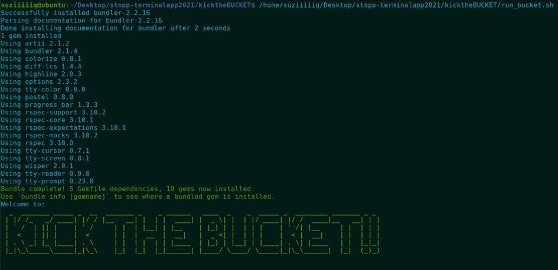
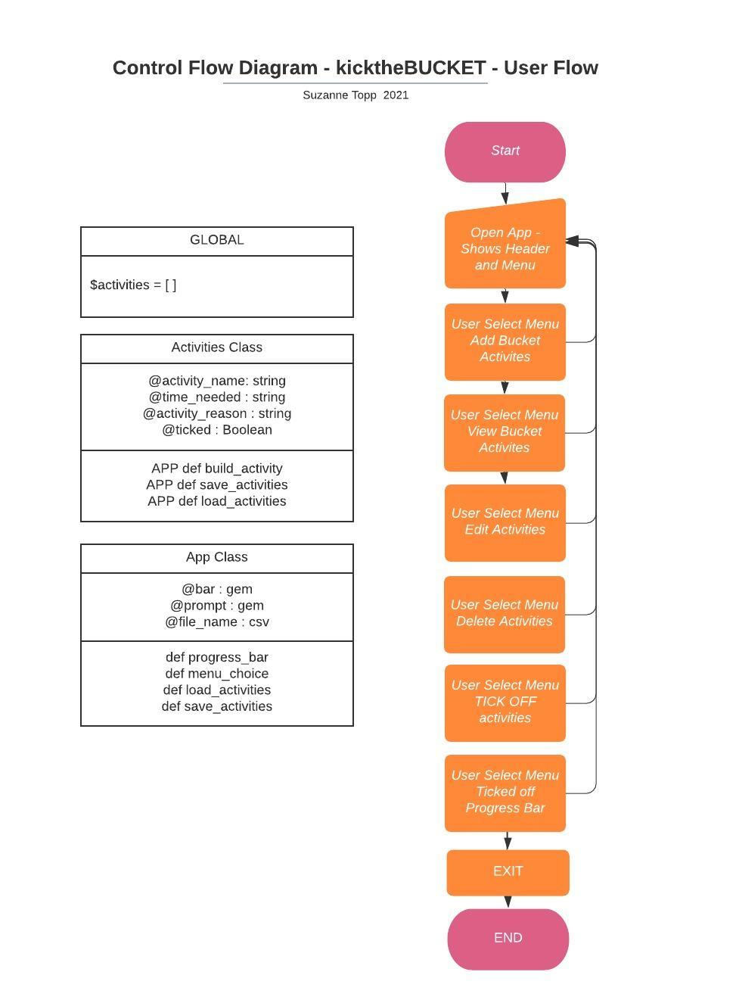

# kicktheBUCKET
## Ruby Terminal App by Suz Topp

### Your POST COVID Bucket List Extravaganza App

---

---

### Link to GitHub Respository

https://github.com/suztopp/kicktheBUCKET

---

### Statement of Purpose

Kick The Bucket has been developed for all the people who need a goal list to achievel.  Especially with the current pandemic, and the hold it's placed on travel and living life, this app will help the user create a DREAM BUCKET LIST, and show them how much progress they've made as a motivational tool.

The application is targetted towards adults, but would appeal to many age groups. 
Most people have a bucket list, and again most of those people with lists would like a way to monitor and tick off this list while they have time.

In my online life I noticed a lack of apps and programs like this one. After being in multiple lock downs and unable to visit my family in both New Zealand and Ireland for some time, and after a brainstorm at home, I realised this would be a great one for me to attack. 

The user will be able to set up their initial list of 10 Bucket List Goals and then edit the existing activities, or mark them as TICKED when completed. They will also have a graphic percentage bar that will show progress to more visual types. 

---

#### Install

1. Clone the Repo from GitHub - https://github.com/suztopp/kicktheBUCKET
1. CD into kicktheBUCKET
2. run in terminal - ./run_bucket.sh

This will install the gem bundler, then install all the dependent gems, then run Kick the Bucket (ruby kickthebucket.rb - how to run if you don't need to install gems)

#### Dependencies

- Ruby (https://www.ruby-lang.org/en/)
- Terminal 
- rspec gem
- artii gem
- progress_bar gem
- tty-prompt gem
- colorize gem

#### Links for Ruby Download and Gems

https://www.ruby-lang.org/en/

https://rubygems.org/gems/artii/versions/2.1.2

https://rubygems.org/gems/rspec/versions/3.5.0

https://rubygems.org/gems/progress_bar

https://rubygems.org/gems/tty-prompt

https://rubygems.org/gems/colorize

---

#### PREPERATION AND DESIGN

I enjoyed utilising the Trello board for my organisation.  As someone that creates a checklist document for everything I do, this allowed me to set goals, tick off checklists which is rewarding in itself, and keep myself on track.  I am learning more about how to use this professionally, and look forward to using it on the job. 

Trello Board - https://trello.com/b/OVWJ8Eid/kick-the-bucket

---

#### FEATURES

Features in the Kick The Bucket activity app!

**CRUD**

Create, Read, Update and Delete

This was not intended to be fully CRUD in the beginning, but as I went through the creative process I decided to fully implement this feature.
The user can add 10 bucket activities, view that list of activities, edit them one by one, and delete them one by one. 
The list only allows for 10 entries, and this makes the setup for this neat. The user can re enter these via edit and delete as many times as they want, but will be entering in the full info for it each time, this will affect the decisions for deeply in my opinion, as they will mostly enter the full set of 10 at the start then work towards this list.  In the future I would love to open this up to have a bigger list, and to have ability to have time goals and or money goals added to the CRUD feature.  Allowing further features to be utilised.  

**PERSISTENT STORAGE - VIA CSV**

I chose to go with a CSV file for persistent storage.  The feature is set so that if the user opens the app for the first time and the file is missing, the app will create that for them to populate with their activities.  The app saves the $activities array to the csv on exit, then loads the csv info when the app is opened.  This means whatever happens during the app use only affects the list at the final step on exiting.  This feature works well, and provides the persistent storage I wanted to offer. 

**INTERACTIVE MENU - Avoid Errors**

I used TTY Prompt on the Main Menu to ensure the error handling was as high as possible.  By removing the option to select the menu option every time the ease and smooth feel of the app stays on the level I was aiming for.  The menu being a constant non changing feature was also something I wanted to offer to the user to keep the feel of the screens consistent, which I also added to with the use of ascii word art above the menu. 

**PERCENTAGE PROGRESS BAR**

I have implemented a cool percentage progress bar that increments every time an activity is marked as ticked off. This gem allows you to set up the increments in the size and regularity that you want, and I felt this was the most fun offer of the app for the user.  

---

**VARIABLES AND SCOPE**

I kept the classes to a minimum as it's my first ever coding project, and I wanted to work on my understanding of code in general first. I have used a global array to house the Bucket Activity hash data, which allowed me to reference it anywhere in the project.
I have used Instance Variables for all of my data and extras.  The Activities class has instance variables for the activity_name, time_needed, activity_reason, and the ticked boolean value. These are initialized with the first call of the $activities array.
In the App class I used @bar for the progress bar element, @prompt for the tty prompt menu, and @file_name to initialize my csv file. 

**LOOPS AND CONDITIONAL CONTROL STRUCTURES**

I have used various loops and control structures in my code.
While Loops - Error Handling in various methods
Case Statements - menu selection
If Else Statements - running command line arguments
Loop Do - In my Welcome Menu
For Loop - In my Display Activities Method - used on most pages of the app

**ERROR HANDLING & TESTING**

I utilised Rspec for testing, although kept this at a minimum as I was using TTY Prompt menus to make selections cleaner.
I have also used loops to make sure the data entered is either excepted as it's within the parameters, or asked for re entry until the correct input is given.
I am happy currently that the app is quite safe to use in regards to errors/testing.

 

 

**COMMAND LINE ARGUMENT FOR --help**

The user can input a command line argument, with both the ruby file and the shell file.  This help file is a fun approach to explaining how to run and install the program, and how to use the functions within the app.

**USER FLOW AND UML CHART**

---

#### FUNCTIONALITY

---

On running the application, the user is present with the MENU.  This menu appears on most pages, and allows the user to access all fetaures of the app.
Selection can be made by using the up and down arrows, and pressing enter to select.

The first menu selection is SET UP YOUR 10 ACTIVITIES
The user can select this option to run through the Activities Details Screens.  There are 10 Bucket Activity slots.
Once these are entered the app will return to the menu after alerting the user their Bucket Activities are Full.

The items you can add for each activity are DREAM BUCKET LIST ACTIVITY, TIME GOAL IN YEARS, and THE REAL REASON YOU HAVE CHOSEN THE ACTIVITY.

Once all 10 are entered, you will be told they are ready to go!

The VIEW ACTIVITIES option is next on the menu.  This allows you to see all your activities at once, using colour to make them easy to find and read.

You can then EDIT ACTIVITIES, if you've made a mistake or wish to add to the notes or details of one of the activities.  You can chose via the activity number, then enter the three info lines again for that activity.

 

The end of editing is signified by the ACTIVITY SUCCESSFULLY UPDATED message.

If you wish to completely delete an activity, as you've changed your mind or your bucket idea, the delete function allows you to select the number of the activity and delete it with one click.

 

The most fun part of this app is is TICKING OFF YOUR ACTIVITIES!  While you make your way through acheiving your list you can keep track of the progres by selecting to TICK THEM OFF.  

 

Example of four activities ticked off out of the list of 10.

You can then view your PROGRESS with the nifty progress bar, showing a percentage for how far you are through your BUCKET ACTIVITY LIST!

When you're done with what you need to create, read, update, delete and TICK OFF, you can use the menu EXIT TO REAL LIFE option to head out and live your life and achieve those goals!

---

#### THANK YOU

Thank you for reading the ReadMe that accompanies my kicktheBucket application.  I appreciate the time you've taken to read through everything, and hope you enjoy using the application if you clone the files.  This has been an extremely rewarding assignment that has taught me a lot about Ruby and terminal applications.  
© Copyright Suz Topp - Melbourne 2021